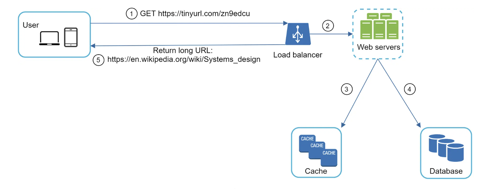

# URL Shortening Service

An example of URL shortening service.  

## Functional Requirements
- Accept a long URL and return a unique short URL  
- Redirect users from short URLs to original URLs  
- Support custom short URLs (when available)  
- Provide basic analytics on link usage  
- Allow URLs to expire after a set time  

## Non-functional Requirements:
- High availability: The service should be available 99.9% of the time  
- Low latency: Redirections should happen in under 100ms  
- Scalability: Handle 100 million daily active users  
- Durability: Short URLs shouldn't be lost for 5 years  

## Capacity planning
Assuming 100 million daily active users (1 day = 86400 seconds), we can estimate:  

- Write operations: If each user creates 3 short URLs per month on average, that's about 115 new URLs per second (3 * 100M URLs / (30 days * 86400)  
- Read operations: URL shorteners are heavily read-focused. With a 100:1 read write ratio, we're looking at about 11,500 redirections per second (115 * 100)  
- Storage: Assuming each URL record is at least 500 bytes (urlIdD, creationDate, userID longURL). Over 5 years, we'd need about 10TB of storage  

115 per second
1 day = 115 * 86400 = 9936000 records
1 year = 9936000 * 365 = 3.62664e9 records
5 years = 3.62664e9 * 5 = 1.81332e10 records
1.81332e10 * 500 bytes = 9.0666e12 bytes
1 TB = 1099511627776 B
1 B = 9.0949470177293E-13 TB
9.0666e12 B = 9.0666e12 * 9.0949470177293E-13 TB
or
9.0666e12 B / 1099511627776 = 8.236 TB

- Bandwidth: Peak traffic could reach several MB/s for serving redirections  

### Estimating Memory
#### Golang data type and size:  
```sh
bool: 1 byte
int8, uint8: 1 byte
int16, uint16: 2 bytes
int32, uint32, float32: 4 bytes
int64, uint64, float64: 8 bytes
string: Typically 16 bytes (pointer to data + length)
slice: Typically 24 bytes (pointer to data + length + capacity)
pointer: 8 bytes on a 64-bit system, 4 bytes on a 32-bit system
```

### Estimating Storage
#### [Postgres data types](https://www.promotic.eu/en/pmdoc/Subsystems/Db/Postgres/DataTypes.htm)
```sh
bigint                      8  
integer	                    4  
smallint	                2  
tinyint	                    1  
bit	                        1 bit  
boolean	                    1  
decimal(precision, scale)	n  
numeric(precision, scale)	n  
real	                    4  
double precision	        8  
money	                    8  
timestamp (precision)	    8  
timestamptz (precision)	    8  
char(n)	                    n  
varchar(n)	                n  
text                        unlimited  
```
## System Architecture and API Design

 
A reference diagram from [bytebytego](https://bytebytego.com/courses/system-design-interview/design-a-url-shortener)

To cater to requests traffic demand, we consider using [load balancer](https://docs.nginx.com/nginx/admin-guide/load-balancer/http-load-balancer/).  


```
POST /setsurl
Content-Type: application/json

{
  "long_url": "https://stackoverflow.com/questions/36279253/go-compiled-binary-wont-run-in-an-alpine-docker-container-on-ubuntu-host",
  "expiry_hrs": "1"
}
```
```
Response:
{
  "unique_id": "********",
  "long_url": "https://stackoverflow.com/questions/36279253/go-compiled-binary-wont-run-in-an-alpine-docker-container-on-ubuntu-host",
  "expiry_hrs": "1",
  "short_url" "https://go/*********"
}
```
```
GET /visit?short_url=https://go/*********
```

Redirect 301 (client should update cache), 302 Found or 307 Temporary Redirect for temporary URL changes.
We will use server-side redirect 302:  
```
Response:
HTTP/1.1 301 Moved Permanently
Location: https://stackoverflow.com/questions/36279253/go-compiled-binary-wont-run-in-an-alpine-docker-container-on-ubuntu-host
Content-Length: 0
```

### Error Response

Consider to standardize REST API error handling by using the IETF devised [RFC 7807](https://datatracker.ietf.org/doc/html/rfc7807), which creates a generalized error-handling schema.

This schema is composed of five parts:  
* type – a URI identifier that categorizes the error
* title – a brief, human-readable message about the error
* status – the HTTP response code (optional)
* detail – a human-readable explanation of the error
* instance – a URI that identifies the specific occurrence of the error
Example:  
```json
{
    "type": "/errors/incorrect-user-pass",
    "title": "Incorrect username or password.",
    "status": 401,
    "detail": "Authentication failed due to incorrect username or password.",
    "instance": "/login/log/abc123"
}
```

### References

https://www.baeldung.com/rest-api-error-handling-best-practices  
https://restfulapi.net/http-status-codes/  

## URL shortening algorithm
Credits to:  
https://www.reddit.com/r/golang/comments/15ai4sb/what_is_base62_conversion_checking_my_own/  

### What is base62 conversion? Checking my own understanding.

Ran into my own limited understanding of base62 conversion while building out a URL shortener in Go and wanted to check my understanding by posting this. :)  

Base62 is a common encoding scheme that's perfect for short URL services and compact data storage.  

It gets its names from the sixty-two characters used for encoding. Those characters are [0-9] 10 + [a-z] 26 + [A-Z] 26 = 62. To convert a decimal to base62 you use long division to divide the decimal by sixty-two. Then you take the remainder and map it to the character that represents it by locating its position within the base62 digits.  

### Example: Convert 123 to base62

#### Step 1: Divide the decimal by 62 until the quotient is zero and keep track of the remainders.

123 ÷ 62 = 1 quotient 61 remainder  

1 ÷ 62 = 0 quotient 1 remainder  

#### Step 2: Use the remainder to map to the base62 character by its position

61 = Z  

The base62 system starts its index at zero, so the last character Z is at position sixty-one  

1 = 1  

Therefore, 123 converted to base62 is 1Z.  

When combining the base62 characters you go from right to left to match the decimal positions.  

### Base62 back to a decimal

#### Step 1: Identify their position value in the base62 system

1 = 1st position  

Z = 61st position  

#### Step 2: Calculate the powers of 62

The calculation of the appropriate power of 62 for each base-62 digit is based on its position.  

You find the power of each digit by taking the length of the base62 number minus the digit's position in the number and then subtract 1.  

Formula: len(base62) -i -1  

1Z = length of 2  

Z's power of 62 eq 2 - 1 - 1 = 0  

1's power of 62 eq 2 - 0 - 1 = 1  

#### Step 3: Convert back to decimals  

1 * 61^1 = 61  

62 * 62^0 = 62  

61+62 = 123  

Here's some sample code in #golang for reference. :)
https://play.golang.com/p/DmFYZXWdzDU


## Build and run surl sample

```sh
make docker-clean-arm64

make docker-build-arm64

make docker-runlocal-arm64
```

Paste this to browser:
```sh
localhost:8282/visitbyshorturl?shorturl=https://go/23bn0CGuIfB
```

```sh
make docker-stop
```
